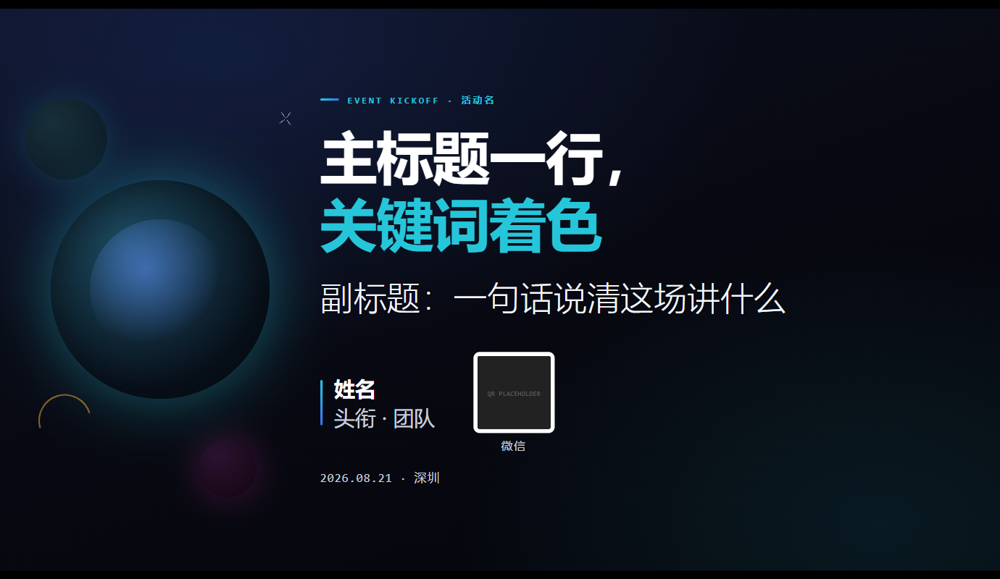
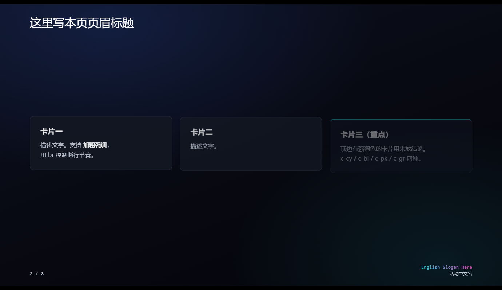
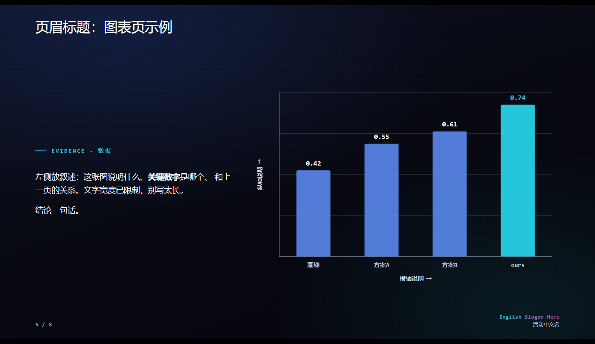

# html-deck-template

A single-file HTML presentation engine. No framework, no build step, no dependencies — one `deck.html` (~27KB), fill in your content, present in any browser.

The engine pattern is inspired by Han Xiao's hand-rolled HTML decks (hanxiao.io) — fixed canvas + scale-to-fit, hard page cuts, cloned per-page chrome, hand-drawn SVG charts, and one-key PDF export.

## Why

| | This template | PowerPoint |
|---|---|---|
| Text & charts | Vector, crisp at any scale | Bitmap exports get blurry |
| Versioning | Plain text, git-friendly | Binary |
| Data-driven charts | JS + SVG, data lives in one place | Manual editing |
| Sharing | One URL, `#12` jumps to slide 12 | File transfer |
| PDF export | Ctrl+P, done | Export wizard |

## Quick start

1. Download `deck.html`, open it in a browser
2. Navigate: arrow keys / space, click (left 32% of the screen goes back), `f` for fullscreen, `#5` in the URL jumps to slide 5
3. Edit content in any editor, refresh to see changes

Add a slide: copy any `<section class="slide">…</section>` block. Page numbers re-flow automatically.

## Page types (8 ready-made)

| class | purpose |
|---|---|
| `.title` | Opening: headline / subtitle / author / QR |
| content + `.cards` | Three-card layout with takeaway line |
| `.claimslide` | Big-statement slide between sections |
| `.divider` | Section divider: number + chapter title |
| chart page | Left text, right SVG chart (`drawDemoChart()` to copy from) |
| `.dtable` | Dark-theme comparison table |
| `.qr-corner` | Any slide with a QR badge (repo / product link) |
| `.closing` | Closing quote + links |

## Global knobs

- **Colors / radii** — CSS variables at the top of `deck.html` (`:root{--cyan:…}`). Change once, applies everywhere.
- **Header & footer** — the `#chrome-src` template block. Cloned into every page automatically, page numbers included.
- **Per-page header title** — the `data-title` attribute on each `<section>`. Empty string hides it.
- **Chart data** — the `CHART_DATA` object in the script. Register new charts in `renderAll()`.

Layout helpers: `.body` (centered content area), `.row` / `.fill`, `.kicker` (labeled intro line), `.takeaway` (bottom conclusion line), accent classes `.cy` / `.bl` / `.pk` / `.gr`, entrance animation `au` + `au-d1/d2/d3`.

## Export to PDF

Ctrl+P → "Save as PDF" → margins "None" → enable "Background graphics". Each slide becomes exactly one 1280×720 page with header/footer intact; animations freeze to their final state.

## Deploy

Push the folder to any static host (GitHub Pages, EdgeOne Pages, etc.). Append `#page-number` to share a direct link to any slide.

## Optional upgrades (notes at the bottom of deck.html)

- MathJax for formulas (two lines to wire in, self-hosted)
- Self-hosted subsetted webfonts (Source Han Sans / Inter)
- In-page auto-playing animations via requestAnimationFrame

## 中文使用说明

See [HOWTO.md](HOWTO.md) for the full Chinese guide (page-type reference, layout cheatsheet, chart how-to, font subsetting, deployment conventions).

## License

MIT
